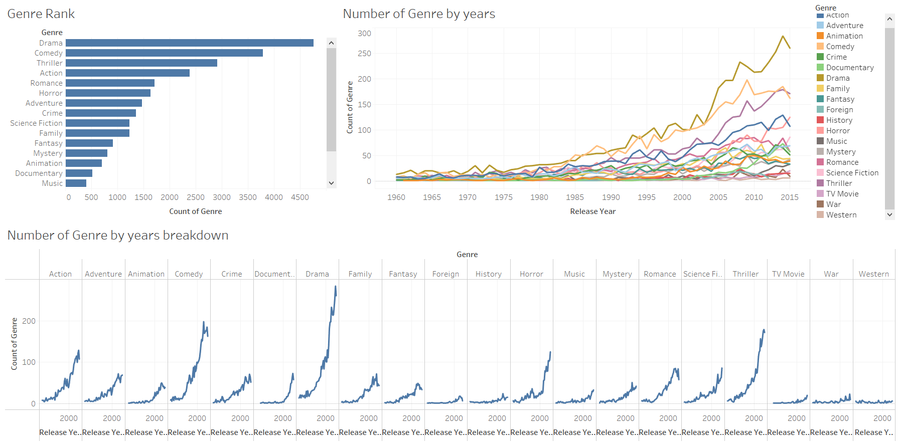
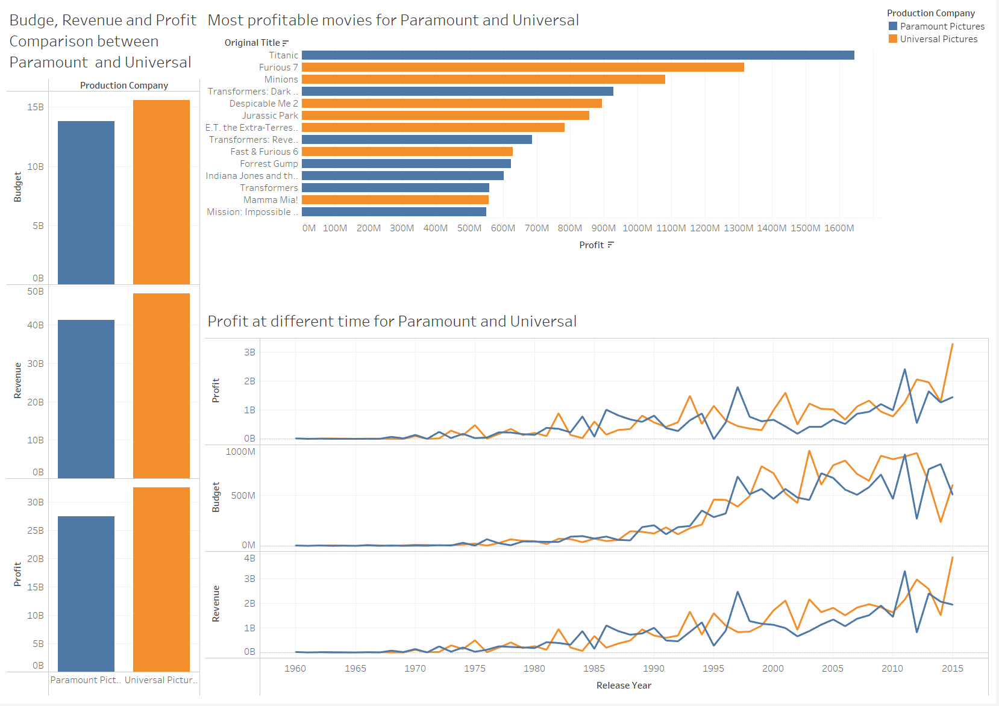
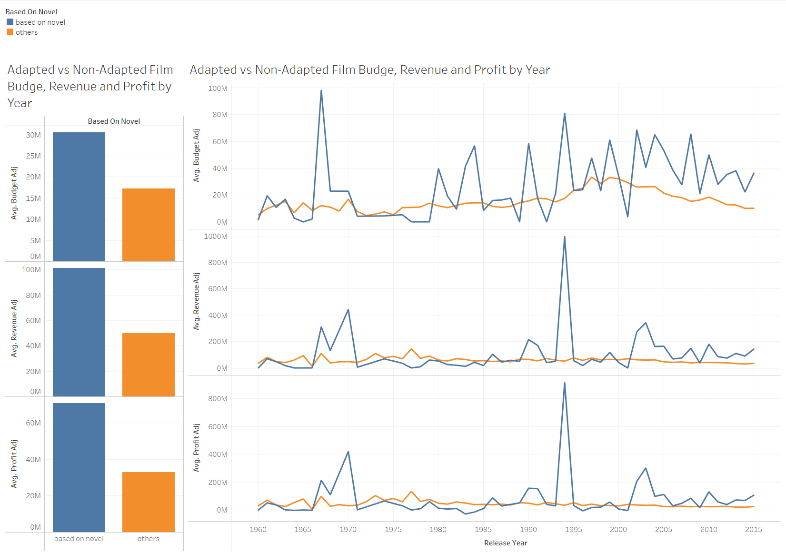
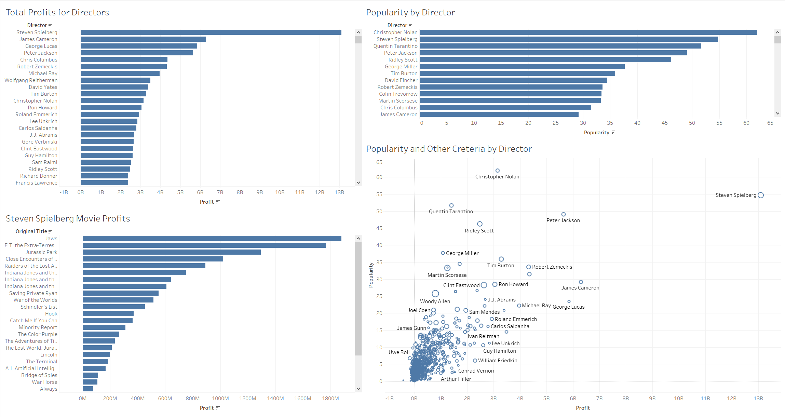
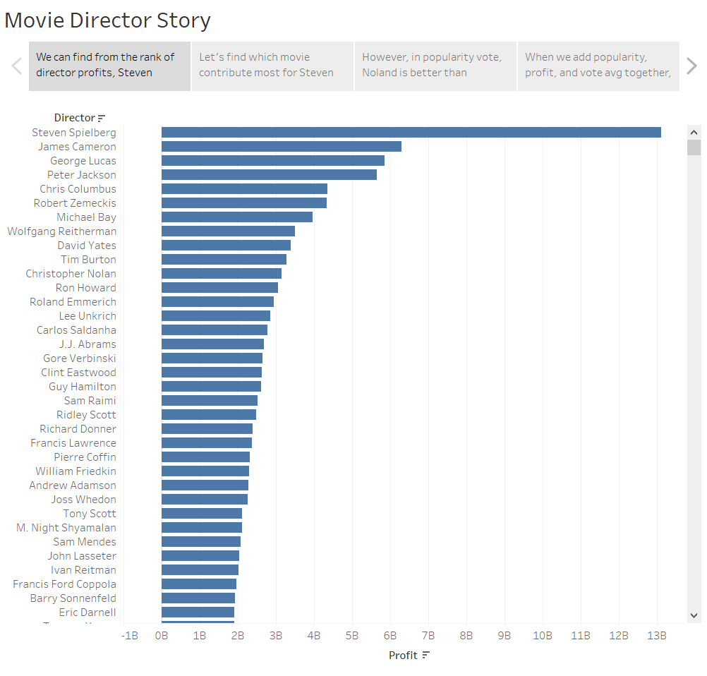

# IMDB Movie Data Visualization


## 1. Dataset

- id:  unique ID
- imdb_id: IMDB ID
- popularity: Revelative views counts on Movie Database
- budget: USD
- revenue: USD
- original_title: title of the movie
- cast：Names of actors, seperated by |
- homepage: Moive homepage URL
- director: Names of directors, seperated by |
- tagline: tag line of the movie
- keywords：Movie keywords, seperated by |
- overview：summary of movie storyline
- runtime：length of the movie
- genres：movie genre, seperated by |
- production_companies：producers, seperated by |
- release_date：On air date
- vote_count：Number of votes
- vote_average：Average of votes
- release_year：On air year
- budget_adj：Budges adjusted by inflation rate (2010, USD)
- revenue_adj：Revenue adjusted by inflation rate (2010, USD)


Data Source: https://www.kaggle.com/stefanoleone992/imdb-extensive-dataset


## 2. Preprocessing

Notebook: https://georgehua.github.io/data-visualizations/Movie/EDA.html


Steps:
- Clean missing values
- Split Genre column
- Split Production companies column
- Create if "based on novel" column
- Split director column

```Python
import matplotlib.pyplot as plt
import numpy as np
import pandas as pd
import seaborn as sns

# load data
movies = pd.read_csv('data/movies.csv')

##### split genre and merge back to original df
split_genres = movies['genres'].str.split('|', expand = True)
split_genres['id'] = movies['id']
merged_back = movies.merge(split_genres)

# save to a new df
melted = pd.melt(merged_back, id_vars = ['id', 'release_year'], value_vars=[0, 1, 2, 3, 4], value_name = 'genre').drop('variable', axis = 1).dropna()
melted.to_csv('data/id_year_genre.csv', index = False)
```

```Python
##### I want to analyze "Universal Pictures" and "Paramount Pictures", so in this step I want to split production companies
split_companies = movies['production_companies'].str.split('|',expand = True)
split_companies['id'] = movies['id']
merged_back_companies = movies.merge(split_companies)

# save to a new df
melted_companies = pd.melt(merged_back_companies, id_vars = ['id','popularity','budget','revenue','original_title','release_year','vote_count','vote_average'],value_vars = [0, 1, 2, 3, 4], value_name = 'production company').drop('variable', axis = 1).dropna()
melted_companies.to_csv('data/production_company.csv', index = False)
```

```Python
##### I also want to analyze if a movie is originated from novel
movies['based on novel'] = movies['keywords'].fillna('NaN')

def based_on_novel(keyword):
    if 'based on novel' in keyword:
        return 'based on novel'
    else:
        return 'others'

# create a movie based on novel column
movies['based on novel'] = movies['based on novel'].apply(based_on_novel)

# save to a new df
movies.to_csv('data/based_on_novel.csv',index=False)
```

```Python
##### In the last step, I want to split director data, same procedure as before
split_director = movies['director'].str.split('|',expand = True)
split_director['id'] = movies['id']
merged_back_director = movies.merge(split_director)

# save to a new df
melted_director = pd.melt(merged_back_director, id_vars = ['id','popularity','budget_adj','original_title', 'revenue_adj','release_year','vote_count','vote_average'],value_vars = [0, 1, 2, 3, 4], value_name = 'director').drop('variable', axis = 1).dropna()
melted_director.to_csv('data/director.csv', index = False)
```


## 3. Visualization

### 3.1. Movie Genre change by year




- From 1960 to 2015, the top five types of films produced in order of number were Drama, Comedy, Thriller, Action, Romance
- Drama and Action have long been the two most numerous genres, and before 2003, the numbers were almost equal, with Drama being slightly higher. And after 2003, the number of drama films began to pull away from the second place action films.
- From the perspective of each genre trend, drama has been in a high growth, comedy since 1976 into high growth, documentary. The number of horror and thriller films increased sharply from 2004


View on Tableau Pubilc: https://public.tableau.com/profile/george.hua2456#!/vizhome/MovieGenreTrend/MovieGenreTrends?publish=yes


### 3.2. Universal Pictures vs. Paramount Pictures



- Overall, from 1960-2015, Universal Pictures was slightly ahead of Paramount Pictures in terms of production volume, budget and revenue.
- In terms of time dimension, the two companies were comparable in terms of data indicators until the 1990s, and from the mid- to late-1990s to 2011, Universal Pictures began to invest in budgets that began to significantly exceed Paramount. From 2011 to 2015, Paramount began to catch up in terms of budget, and the two companies' data entered a stalemate again.
- Among the top-grossing films of both companies, Paramount's highest-grossing film is Titanic and Universal's highest-grossing film is Furious 7, which shows that Universal has slightly more high-earning films than Paramount.

View on Tableau Pubilc: https://public.tableau.com/profile/george.hua2456#!/vizhome/Movieproducerscomparison/Movie_Producer_Comparison


### 3.3. Popularity of Film adaptation



- In terms of budget, revenue, and popularity, movies based on novels are much higher than other non-adapted movies.
- Novel-based movies peaked in 1994 and 2003 respectively, and the budget for novel-based movies has been increasing year by year since 1994.

View on Tableau Pubilc: https://public.tableau.com/profile/george.hua2456#!/vizhome/MovieAdaptionProfit/MovieAdaptionAnalysis


### 3.4. Who is the best director?

Display as Dashboard:



View on Tableau Pubilc: https://public.tableau.com/profile/george.hua2456#!/vizhome/MovieDirector/MovieDirector?publish=yes

However, dashboard has limited space for the 4 charts, we can use a data story to show the visualizations



- The director with the highest profit is Steven Spielberg, in which he directed two films, Jaws and ET, which contributed 27.85% of all his profits
- In terms of popularity, the highest director is Christopher Nolan
- Comparing profits, popularity, and ratings, Steven Spielberg has very high numbers, making him the most successful director of all time.

View on Tableau Pubilc: https://public.tableau.com/profile/george.hua2456#!/vizhome/MovieDirectorStory/MovieDirectorStory?publish=yes