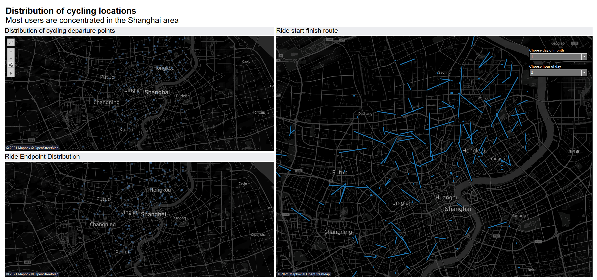
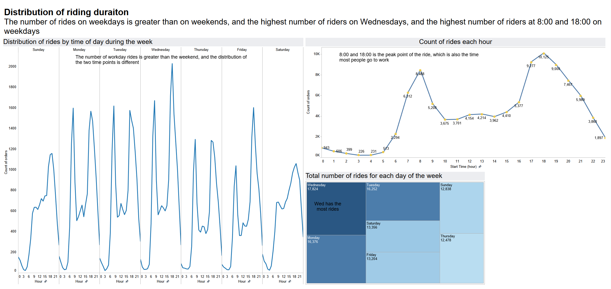
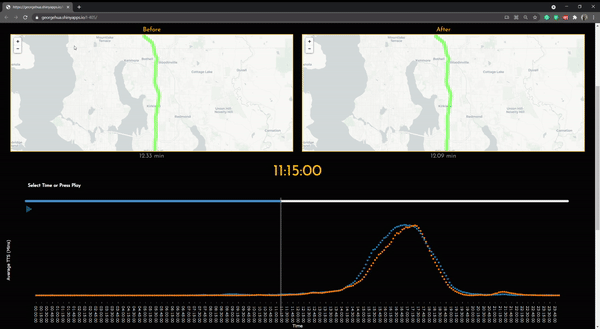

# Data Visualization Collection

Collection of my data visualization project. Tools used: Tableau, R ShinyApp, Python, JavaScript

## 📄 Tableau Projects

### IMDB Movie Analysis

**Business question:** How does the two film production giants Universal Pictures vs. Paramount Pictures perform over the years? And which director makes most profits?

**View more in Project Repository**: https://github.com/georgehua/data-visualizations/tree/main/Movie 

**Data source:** [Kaggle imdb-extensive-dataset](https://www.kaggle.com/stefanoleone992/imdb-extensive-dataset)

**Tools used:** Tableau, Python (Pandas, Numpy, Matplotlib)

### BikeShare Analysis Report

**Business question:** Which day of the week and which time of the day, do people ride most? Where do people ride most in Shanghai city?

**View more in Project Repository**: https://github.com/georgehua/data-visualizations/tree/main/Shanghai%20Bikeshare

**Data source:** [SODA DATA Challenge](http://shanghai.sodachallenges.com/data.html?lang=en)

**Tools used:** Tableau, Python (Pandas, Numpy, Matplotlib)

## 📄 R ShinyApp Project

### Seattle I-405 CHANGES (Travel Time Analysis of the Toll Lane Implementation)

**Business question:** Does the average travel time of  I-405 corridor improves after the introduction of new Express Toll Lane?

**View more in Project Repository**: https://github.com/georgehua/seattle-i405-traffic-viz 

**Live view:** https://georgehua.shinyapps.io/I-405/ (Note: expecting longer waiting time to open, ShinyApp server needs around 15 seconds to start)

**Data source**: Multi-sources data, Washington State Department of Transportation private data

**Tools used**: JavaScript, R (Leaflet, dplyr, plotly, shiny and jsonlite)

