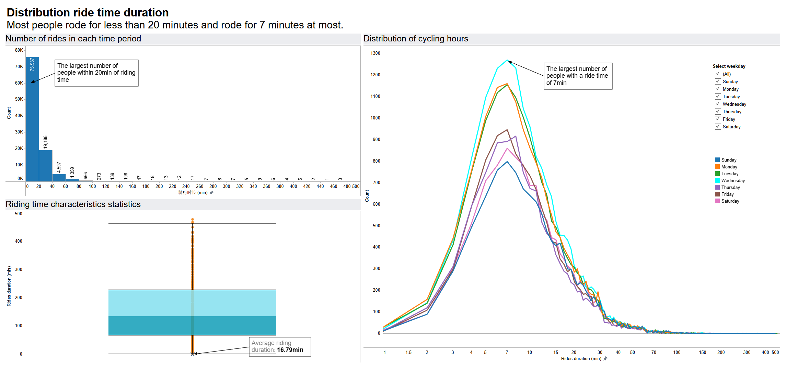

# BikeShare User Rides Analysis


## Business Question

Which day of the week and which time of the day, do people ride most? Where do people ride most in Shanghai city?


## Dataset

**Data source:**  [SODA DATA Challenge](http://shanghai.sodachallenges.com/data.html?lang=en)

This dataset is a random sample of millions of user usage data provided by Mobike in Shanghai city, including origin, destination, rental time, return time, user ID, vehicle ID, and transaction number. The dataset is the sample data of Shanghai SODA competition.

|      | orderid | bikeid | userid | start_time       | start_location_x | start_location_y | end_time         | end_location_x | end_location_y | track                                                        |
| ---- | ------- | ------ | ------ | ---------------- | ---------------- | ---------------- | ---------------- | -------------- | -------------- | ------------------------------------------------------------ |
| 0    | 78387   | 158357 | 10080  | 2016-08-20 06:57 | 121.348          | 31.389           | 2016-08-20 07:04 | 121.357        | 31.388         | 121.347,31.392#121.348,31.389#121.349,31.390#121.350,31.390#121.351,31.390#121.351,31.391#121.352,31.391#121.353,31.391#121.353,31.394#121.354,31.391#121.355,31.391#121.356,31.389#121.356,31.390#121.356,31.391#121.357,31.388#121.357,31.389 |
| 1    | 891333  | 92776  | 6605   | 2016-08-29 19:09 | 121.508          | 31.279           | 2016-08-29 19:31 | 121.489        | 31.271         | 121.489,31.270#121.489,31.271#121.490,31.270#121.490,31.271#121.491,31.271#121.492,31.270#121.492,31.271#121.493,31.269#121.493,31.270#121.494,31.268#121.494,31.269#121.495,31.269#121.495,31.270#121.496,31.270#121.497,31.270#121.497,31.271#121.498,31.272#121.499,31.272#121.499,31.273#121.500,31.273#121.500,31.274#121.501,31.274#121.502,31.273#121.502,31.274#121.503,31.273#121.504,31.273#121.504,31.274#121.505,31.274#121.505,31.275#121.506,31.275#121.506,31.276#121.506,31.277#121.507,31.277#121.507,31.278#121.507,31.279#121.508,31.279 |
| 2    | 1106623 | 152045 | 8876   | 2016-08-13 16:17 | 121.383          | 31.254           | 2016-08-13 16:36 | 121.405        | 31.248         | 121.381,31.251#121.382,31.251#121.382,31.252#121.382,31.253#121.382,31.254#121.383,31.250#121.383,31.251#121.383,31.254#121.384,31.250#121.385,31.250#121.386,31.250#121.387,31.250#121.387,31.251#121.388,31.251#121.388,31.252#121.389,31.251#121.389,31.252#121.390,31.251#121.391,31.251#121.392,31.251#121.393,31.248#121.393,31.250#121.394,31.248#121.394,31.249#121.394,31.250#121.395,31.248#121.396,31.248#121.397,31.248#121.398,31.248#121.399,31.248#121.400,31.248#121.401,31.248#121.402,31.248#121.403,31.248#121.404,31.248#121.404,31.249#121.405,31.249#121.406,31.248#121.406,31.249#121.407,31.248#121.407,31.249 |


## Preprocessing

Notebook: https://georgehua.github.io/data-visualizations/BikeShare/mobike_data_wrangle.html


Steps:
- Clean missing values

- Drop duplicated values

- Split track column by "#" sign, and create  track_location_x, track_location_y

- Convert start_time and end_time to date_time into datetime format

- Create a duration column by substract start_time and end_time to date_time

```Python
%matplotlib inline
import pandas as pd
from pandas import DataFrame
import numpy as np

# load data
mobike_data = pd.read_csv("data/mobike_shanghai_sample_updated.csv")

# check duplcaition
mobike_data[mobike_data.orderid.duplicated()]

# split track column
mobike_data_clean.track = mobike_data_clean.track.str.split('#')

orderid_list = []
track_x = []
track_y = []

for index in mobike_data_clean.index:
    for element in mobike_data_clean.track.loc[index]:
        temp_x, temp_y = element.split(',')
        orderid_list.append(mobike_data_clean.orderid.loc[index]) 
        track_x.append(temp_x)
        track_y.append(temp_y)
data = {"orderid": orderid_list, "track_x": track_x, "track_y": track_y}
track_data = DataFrame(data)

mobike_data_clean = pd.merge(mobike_data_clean, track_data)
mobike_data_clean = mobike_data_clean.drop("track", axis = 1)

mobike_data_clean.track_y = mobike_data_clean.track_y.str.extract('(\d{2}\.\d{1,3})' ,expand=True)

mobike_data_clean.track_x = mobike_data_clean.track_x.astype('float')
mobike_data_clean.track_y = mobike_data_clean.track_y.astype('float')

# convert to datetime format
mobike_data_clean.start_time = pd.to_datetime(mobike_data_clean.start_time)
mobike_data_clean.end_time = pd.to_datetime(mobike_data_clean.end_time)


# save to a new df
save_file_name = 'data/cleaned.csv'
mobike_data_clean.to_csv(save_file_name, encoding='utf-8',index=False)
```


## Visualization

### 

View on Tableau Pubilc: https://public.tableau.com/profile/george.hua2456#!/vizhome/BikeShareReport/ShanghaiBikeShareStory?publish=yes





